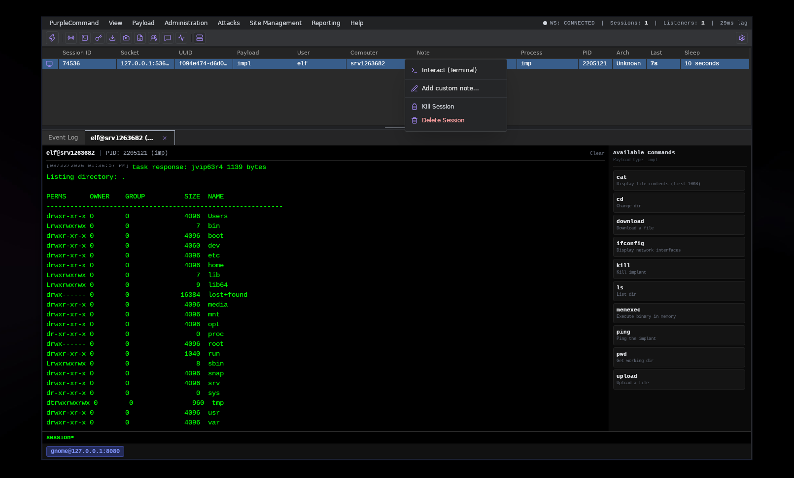

<div align="center">
  
</div>

# PurpleCommand web and desktop UI


PurpleCommand UI can use Wails to package the interface as a native desktop executable. The browser build remains available.



## Linux prerequisites

Ubuntu 25.10 provides WebKitGTK 4.1, so this project enables Wails' `webkit2_41` build tag in `wails.json`.

```sh
sudo apt update
sudo apt install libgtk-3-dev libwebkit2gtk-4.1-dev
```

Go 1.22 or newer and Node.js are also required. The npm scripts run the pinned Wails v2.12.0 CLI through `go run`, so a global Wails installation is optional.

## Development

```sh
npm ci
npm run desktop:dev
```

`desktop:dev` starts the Vite development server and opens the interface in a native Wails window with hot reload.

## Production executable

```sh
npm run desktop:build
```

The executable is written to `build/bin/purplecommand`. A debug executable with WebView developer tools can be produced with:

```sh
npm run desktop:build:debug
```

Build Windows and macOS releases on their respective operating systems so Wails can use the native platform toolchain and packaging facilities.
